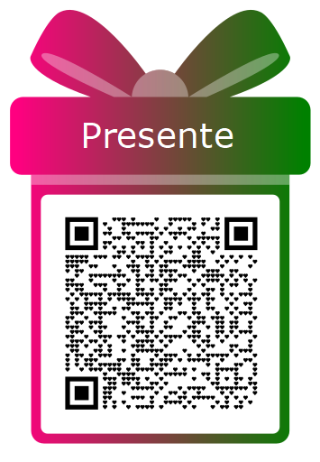

# ❤️ Site do meu casamento ❤️

Desenvolvido com vite e publicado com github pages

Areas:
- Video Save the Date
- Arte dos noivos
- Save the Date com data e local
- Momentos Especiais
- Lista de presentes engraçadinha
- Informações de como chegar e transporte

Como deployar:
- Rodar o build do projeto com o comando "npm run build"
- Copiar o conteudo da pasta "dist" para a pasta "docs"
- Atualizar o repositório no github

Lista de inspirações
https://withjoy.com/anderson-and-bruna/welcome

### Montagem QRCode

Utilizar uma plataforma para gerar o pix adequado:
https://www.qrplus.com.br/gerador-de-pix

Colocar moldura de presente e ir gerando para cada valor.
Adicionar um botão para copiar o texto, dai a pessoa já consegue usar no app do banco também.
